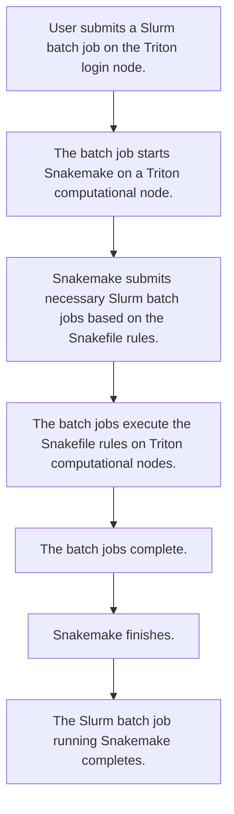

# Using Snakemake on Aalto Triton

[Snakemake](https://snakemake.readthedocs.io/en/stable/) is a workflow management tool used to create reproducible and scalable data processing workflows.

This repo contains two small example projects which can be cloned and run on the [Aalto Triton](https://scicomp.aalto.fi/triton/) cluster.

The projects are located in folders `multiple-input-files` and `parameter-grid`.

In the project `multiple-input-files`, we run a pipeline of two computational steps. The first step loops over multiple input data files and processes them in parallel. The subsequent second step collects the processing results and combines them.

In the project `parameter-grid`, we loop over two parameters and run a Python script using each parameter combination as input in parallel.

For detailed instructions, see [parameter-grid/README.md](parameter-grid/README.md) and [multiple-input-files/README.md](multiple-input-files/README.md)

## About the projects

The projects

1. follow the [recommended Snakemake project structure](https://snakemake.readthedocs.io/en/stable/snakefiles/deployment.html),
2. use conda environments for [integrated package management](https://snakemake.readthedocs.io/en/stable/snakefiles/deployment.html),
3. use the [Slurm executor plugin](https://snakemake.github.io/snakemake-plugin-catalog/plugins/executor/slurm.html) to submit the workflow steps as cluster jobs,
4. decouple the workflow and Slurm resource configurations using a [Snakefile](https://snakemake.readthedocs.io/en/stable/snakefiles/rules.html) and a [profile configuration file](https://snakemake.readthedocs.io/en/stable/executing/cli.html#profiles), respectively.

The workflow is run on Triton using Slurm in the following manner:

